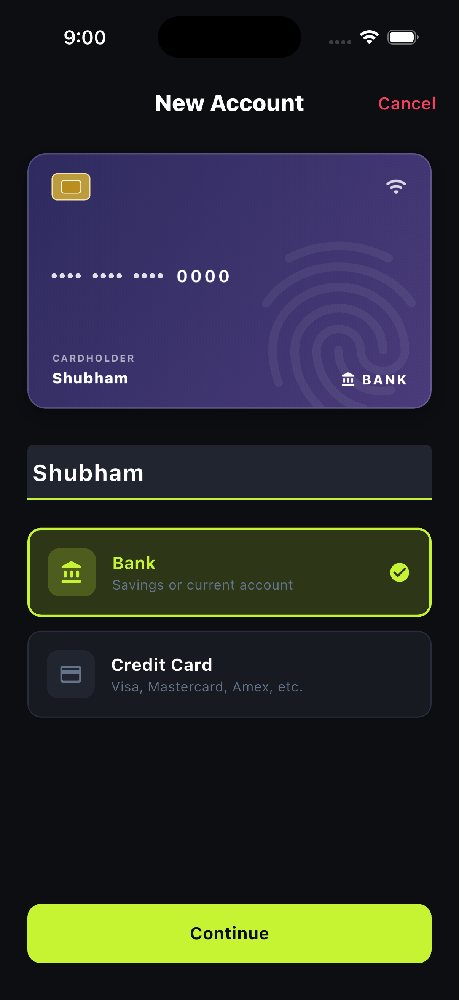
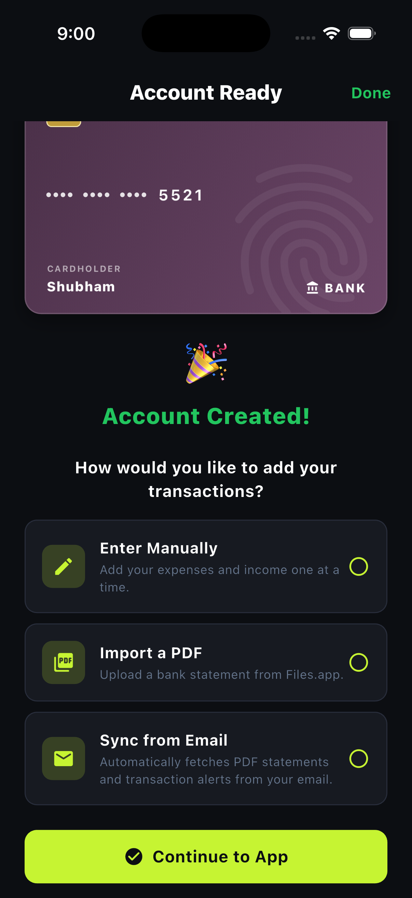
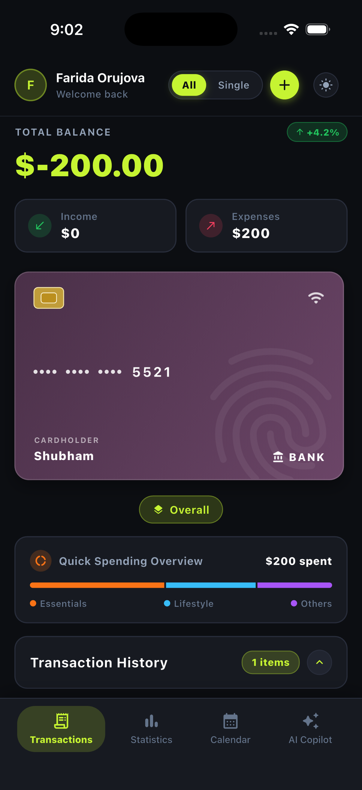
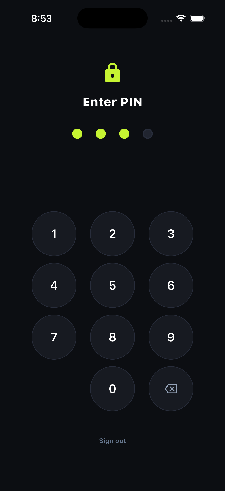
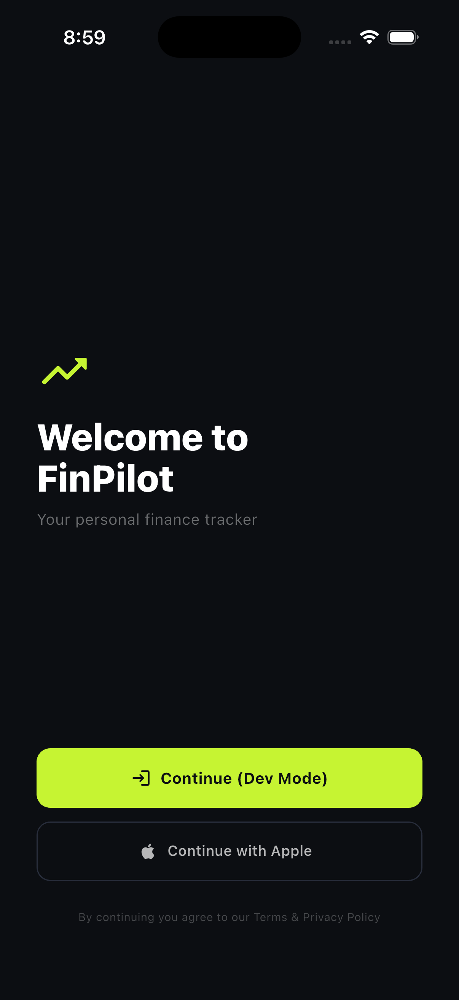
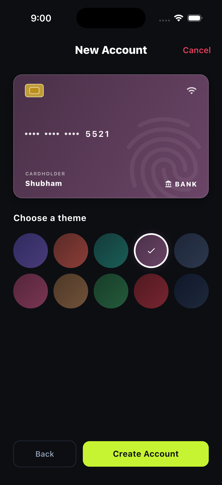
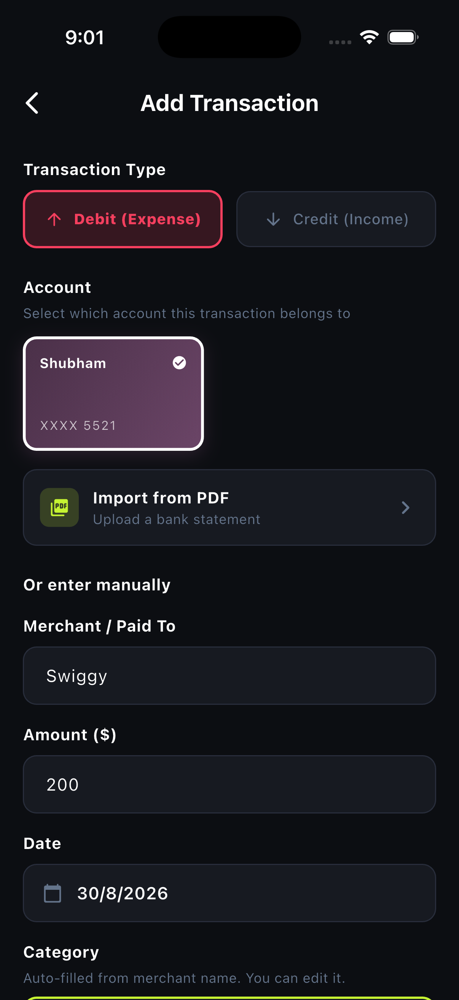
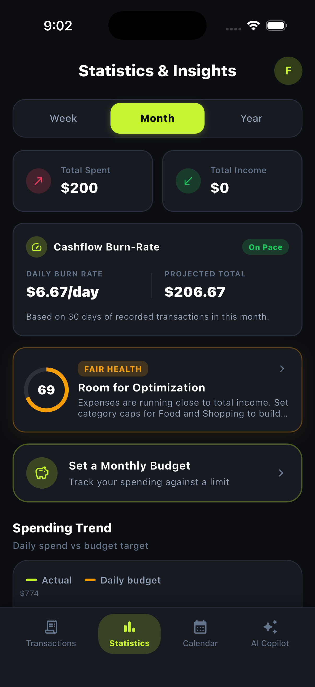
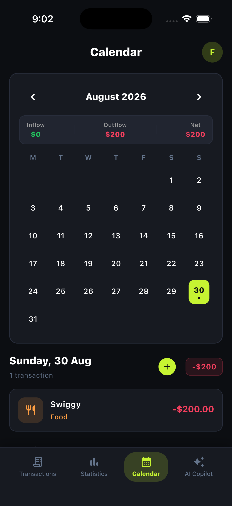

# 🚀 FinPilot — Next-Gen Personal Finance & AI Copilot

<p align="center">
  
  &nbsp;&nbsp;
  
  &nbsp;&nbsp;
  
</p>

<p align="center">
  <b>FinPilot</b> is an ultra-premium, offline-first personal finance application built with Flutter, Riverpod, Hive NoSQL, and Gemini AI. Designed with high-end fintech aesthetics, tactile haptic feedback, 3D stacked physical card interactions, bank statement PDF parsing, and fiduciary financial intelligence.
</p>

<p align="center">
  <a href="https://flutter.dev"></a>
  <a href="https://dart.dev"></a>
  <a href="https://riverpod.dev"></a>
  <a href="https://hivedb.dev"></a>
  <a href="https://ai.google.dev"></a>
</p>

---

## 🌟 Key Features

### 1. 💳 Interactive 3D Card Stack
- **Physical 1.586:1 Credit Card Aspect Ratio**: Realistic ISO/IEC 7810 ID-1 standard dimensions.
- **3D Card Flip**: Tap any card to flip it over in 3D space to reveal card details, EMV chip, and instant **Freeze / Unfreeze** toggles.
- **Card Freezing Engine**: Freezing an account immediately excludes its balances and transactions from overall metrics and collapses it cleanly from the active stack.
- **Custom Aesthetic Themes**: Obsidian Slate, Emerald Glow, Crimson Gold, Royal Purple, Neon Cyberpunk, and Classic Titanium.

### 2. 📊 Precision Analytics & Diagnostic Health Score
- **Interactive Donut Breakdown**: Multi-color segment chart with instant category percentages and spend totals.
- **Category & Merchant Drill-Downs**: Tap on any category or merchant to view transaction history and average spend.
- **Fiduciary Health Score (0-100)**: Algorithmic assessment evaluating savings rate, discretionary ratio, and recurring commitments.
- **Cashflow Burn-Rate Velocity**: Tracks daily spending velocity against projected monthly cash burn.

### 3. 🤖 FinPilot AI Wealth Copilot
- **Gemini Fiduciary Advisor**: Natural language financial advisory powered by Google Gemini API.
- **Offline Heuristic Intelligence Engine**: Automatic local analysis fallback that calculates budget health, savings rate, and expense reduction recommendations completely offline when no API key is present.
- **Quick Prompt Chips**: One-tap queries (*"How can I save $200 this month?"*, *"Analyze my top spending categories"*, *"Show recurring subscriptions"*).

### 4. 📄 Encrypted PDF Bank Statement Import
- **Instant Bank Statement Parsing**: Built-in parsers for **SBI**, **HDFC**, **ICICI**, and **Axis Bank** PDF statements.
- **Password-Protected PDFs**: Secure credential decryption for password-protected bank exports.
- **Automatic Rule-Based Categorization**: 71-preset merchant keyword engine automatically assigns categories (Food, Groceries, Shopping, Bills, Transport, Health).

### 5. 📅 Interactive Cashflow Calendar Heatmap
- **Daily Inflow / Outflow Pills**: Visual green/red intensity indicators on every calendar day.
- **Daily Detail Panel**: Tap any date to inspect transaction logs, net daily variance, and payment method summaries.

### 6. 🔒 Bank-Grade Security & PIN Lock
- **4-Digit Passcode & Biometric Security**: Guarded by secure keychain storage (`flutter_secure_storage`).
- **Encrypted Local Storage**: Lightning-fast offline NoSQL persistence via `hive_flutter`.
- **First-Time App Walkthrough**: Interactive 4-step onboarding carousel with helpful hint boxes, skip, and tactile navigation controls.

---

## 📸 App Screenshots

| 1. Onboarding Walkthrough | 2. 4-Digit PIN Security | 3. 3D Card Dashboard |
|:---:|:---:|:---:|
|  |  |  |

| 4. 3D Card Flip Controls | 5. Analytics & Health Score | 6. Calendar Cashflow |
|:---:|:---:|:---:|
|  |  |  |

| 7. AI Copilot Advisor | 8. Connected Accounts & Freeze | 9. Rules & Security |
|:---:|:---:|:---:|
|  |  |  |

---

## 🏗️ Architecture & Project Structure

FinPilot follows **Clean Architecture** principles with **Feature-First modularization** and Riverpod 2.0 State Management:

```
lib/
├── core/
│   ├── accessibility/          # High-contrast & text scaling notifiers
│   ├── providers/              # Core global service providers
│   ├── router/                 # App state routing & lock screen dispatch
│   ├── services/               # Auth, Secure Storage, and PIN services
│   ├── state/                  # AppStateNotifier & session lifecycle
│   ├── theme/                  # Luxury Dark/Light tokens & Category palettes
│   └── utils/                  # Card gradient & formatting helpers
│
├── features/
│   ├── accounts/               # 3D Cards, freeze engine, Add Account multi-step flow
│   ├── ai/                     # Gemini AI & offline heuristic analytics advisor
│   ├── auth/                   # Authentication & biometric session states
│   ├── budget/                 # Category spend targets & progress tracking
│   ├── calendar/               # Cashflow heatmap calendar & day breakdown
│   ├── import/                 # PDF e-statement parsers (SBI, HDFC, ICICI, Axis)
│   ├── onboarding/             # PIN creation & interactive app walkthrough tour
│   ├── profile/                # Account management, security settings, export
│   ├── rules/                  # 71-preset merchant categorization engine
│   ├── shell/                  # Elevated bottom navigation shell
│   ├── statistics/             # Donut charts, health calculator, cashflow velocity
│   └── transactions/           # Transaction feed, quick actions, summary numbers
│
└── main.dart                   # Application entry point & Hive initialization
```

---

## 🚀 Getting Started

### Prerequisites
- [Flutter SDK](https://docs.flutter.dev/get-started/install) (`>= 3.3.0`)
- [Dart SDK](https://dart.dev/get-dart) (`>= 3.0.0`)
- Android Studio / Xcode for device simulation

### Installation

1. **Clone the repository:**
   ```bash
   git clone https://github.com/TapItNinja/FinPilot.git
   cd FinPilot/apps/FinPilot
   ```

2. **Install Flutter dependencies:**
   ```bash
   flutter pub get
   ```

3. **(Optional) Configure Gemini API Key:**
   Create a `.env` file in `apps/FinPilot/` or pass the environment variable at build time:
   ```bash
   GEMINI_API_KEY=your_gemini_api_key_here
   ```
   *(Note: If no API key is provided, FinPilot automatically activates its built-in offline intelligence engine).*

4. **Run the application:**
   ```bash
   flutter run
   ```

5. **Run automated test suite:**
   ```bash
   flutter test test/unit_test.dart
   flutter analyze
   ```

---

## 🧪 Testing & Verification

FinPilot includes comprehensive test suites covering:
- **Freeze / Unfreeze State Invariants**: Validates balance recalculations and active stack exclusion.
- **Financial Health Scoring**: Validates tier calculations, discretionary ratios, and commitment baselines.
- **Transaction Aggregations**: Tests net inflow, outflow, and top category metrics.
- **Onboarding & Tour States**: Validates first-time walkthrough state lifecycle and secure token persistence.

---

## 📄 License
This project is licensed under the MIT License — see the [LICENSE](LICENSE) file for details.

Developed with ❤️ by **[TapItNinja](https://github.com/TapItNinja)**
